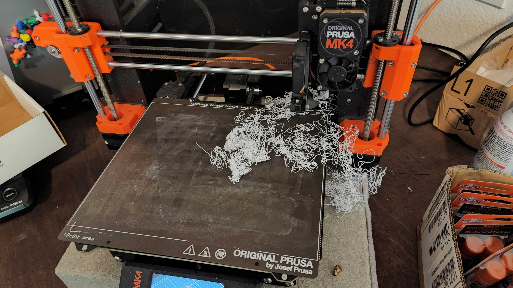

# Failure #136

 

# Stats
| | |
|:---|:---|
| Failures in this run | 1 |
| Print Settings | <ul><li>0.4 nozzle</li><li>PLA</li><li>Input Shaper</li><li>15% infill</li></ul> |
| Filament used in Failure | .008 KG |
| Print Time Wasted | 30 min |
| Name of Print | Helix Space Rocket |
| Link to Print | https://www.printables.com/model/934716-helix-space-rocket-fidget-vortex-spinner-toy |

# Thoughts

The print instructions suggested a brim, which I did not use when printing the rocket portion.
I think that is why it failed or it may also have failed due to using the input shaper to reduce the print time.

# Resolution

Once I added Brims printed just fine with Input Shaper

